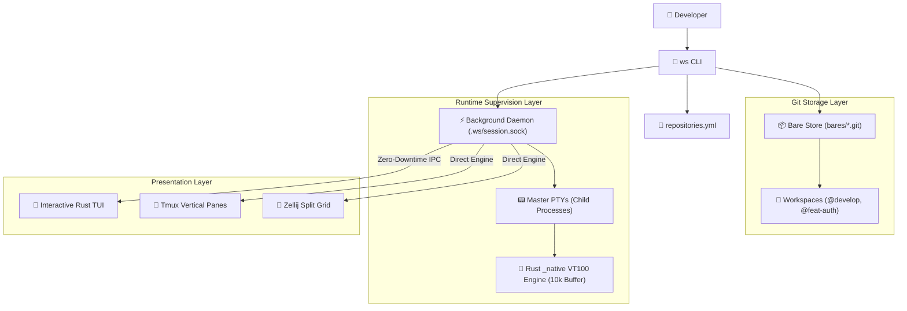

# 🛠️ `ws` — Multi-Repository Git Workspace Manager

[](docs/index.md)
[](docs/architecture.md)
[](LICENSE)
[](docs/index.md)

`ws` is a high-performance, enterprise-grade multi-repository Git workspace and service runtime manager powered by **Git worktrees**, a persistent **background supervisor daemon**, and a native **Rust terminal engine**.

It elevates the **workspace** (a synchronized set of Git repositories) as the primary unit of work. Software engineers working across microservices or multi-repo projects (e.g. backend API, frontend web, mobile app) can create, branch, status, lock, pull, push, and teardown linked worktrees with zero manual overhead.

---

## 🌟 Key Features

* 🚀 **Workspace-Centric Polyrepo Workflow**: Create and manage synchronized feature branches across arbitrary Git repositories simultaneously.
* 📦 **Instant Git Worktrees**: Uses bare repositories (`bares/<repo>.git`) to instantiate full development workspaces in under 100ms with zero disk duplication.
* 🔄 **Zero-Downtime Presentation Switching**: Migrate live running services between an **Interactive Rust TUI**, **Tmux vertical panes**, and **Zellij** without stopping processes or losing state.
* 🔒 **Selective Tracked File Locking (`ws lock`)**: Lock tracked repository files (`chmod a-w` via `git ls-files`) to prevent accidental edits while keeping build caches (`node_modules/`, `target/`, `.env`) writable.
* 🖥️ **High-Performance Rust Terminal Engine**: Real-time headless VT100/ANSI screen parser with a 10,000-line lossless ring buffer preserving progress bars and carriage returns (`\r`).
* 🏷️ **Intuitive Sigil Semantics**: Clean `@<workspace>` (e.g. `@develop`) and `%<repo>` (e.g. `%server`) targets with forgiving shell parsing.
* ⚡ **Universal Inverted Shorthand Syntax**: Run `ws @develop start --tmux` or `ws @develop shell %mobile` from any directory.
* 🛡️ **Atomic Rollback Engine**: Guaranteed filesystem and Git resource cleanup if workspace creation encounters failures mid-flight.
* 🩺 **Automated Environment Diagnostics (`ws doctor`)**: Instant health verification for Git versions, multiplexers, and Unix domain sockets.

---

## 🏗️ Architecture Overview



---

## 🚀 Quick Start in 3 Minutes

### 1. Install `ws` Globally
```bash
git clone https://github.com/franckKyete/ws-manager.git
cd ws-manager
pip install .
```

### 2. Initialize Bare Repositories (`ws project init`)
```bash
ws project init server=git@github.com:example-org/api.git \
                mobile=git@github.com:example-org/app.git
```

### 3. Create a Feature Workspace (`ws create`)
```bash
# Create feature/auth branch across server and mobile:
ws create @feat-auth %server %mobile

# Or checkout existing develop for server while branching mobile:
ws create @feat-auth %server:develop:existing %mobile:feature/auth:new
```

### 4. Start Services in Tmux or TUI (`ws start`)
```bash
# Start in Tmux side-by-side vertical panes:
ws start @feat-auth --tmux

# Switch live presentation to Rust TUI with zero downtime:
ws attach @feat-auth --switch
```

### 5. Open an Interactive Subshell (`ws shell`)
```bash
ws shell @feat-auth %server
```

---

## 📖 Comprehensive Documentation

Explore the full documentation suite in the [`docs/`](docs/index.md) directory:

* [**📖 Documentation Portal**](docs/index.md): Central documentation hub.
* [**🚀 Getting Started**](docs/getting-started.md): Installation, prerequisites, and step-by-step tutorial.
* [**💻 CLI Reference Manual**](docs/cli-reference.md): Complete guide to all commands, options, and aliases.
* [**⚙️ Configuration Specification**](docs/configuration.md): `repositories.yml` & `workspace.yml` syntax, environment variables, and setup scripts.
* [**🏛️ Architecture & Internals**](docs/architecture.md): Deep dive into the Git worktree model, daemon architecture, and Rust terminal engine.
* [**🖥️ Multiplexers & Runtime**](docs/multiplexers-and-runtime.md): TUI, Tmux vertical panes, Zellij, detached daemon, and zero-downtime switching.
* [**🌲 Worktree Management**](docs/worktree-management.md): Multi-repo feature branching, worktree locking (`ws lock`), and safe push/pull.
* [**🩺 Troubleshooting & Diagnostics**](docs/troubleshooting.md): Diagnostic workflows with `ws doctor`, socket debugging, and recovery.

---

## 🧪 Testing & Quality Assurance

Run the automated test suite:

```bash
# Run Python pytest suite (51 tests)
python3 -m pytest ws/tests/ -v

# Run Rust engine test suite (8 unit tests, 1 doctest)
cargo test --workspace
```

---

## 📄 License

Distributed under the MIT License. See [LICENSE](LICENSE) for more information.
