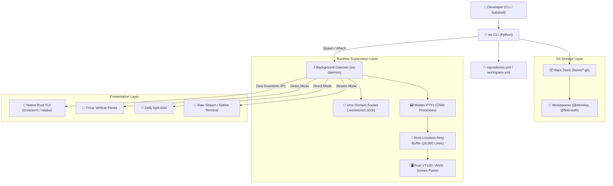

# 🏛️ Architecture & System Internals

`ws` is designed as a high-performance, hybrid Python/Rust tool that combines the safety of Git worktrees with an enterprise-grade process supervision daemon and headless terminal screen emulator.

---

## 🏗️ System Architecture Diagram



---

## 1. Git Storage Model: Bare Store & Worktrees

Traditional multi-repository management either duplicates clones (`git clone`) or relies on Git submodules. Both approaches suffer from substantial downsides:
- **Duplicate Clones**: Wastes gigabytes of disk space and requires re-cloning for every branch or feature test.
- **Git Submodules**: Notoriously fragile, hard to branch simultaneously, and painful during merge conflicts.

### The `ws` Worktree Model
1. **Single Bare Clone (`bares/<repo>.git`)**:
   - Each repository is cloned once with `--bare`.
   - The bare repository holds the complete Git object database and commit graph.
2. **Instant Worktree Creation (`workspaces/@<name>/<checkout>`)**:
   - Creating a workspace executes `git worktree add -b <branch> <path>`.
   - Worktree checkouts take **under 100 milliseconds** and consume zero duplicate object storage.
   - Worktrees can be deleted and recreated freely without risking committed history in the bare store.

---

## 2. Background Supervision Daemon & Unix Socket IPC

When services are started with `ws start`, `ws` spawns a detached background supervisor daemon.

### Key Characteristics:
- **Dedicated Unix Domain Socket**: Bound to `.ws/session.sock` inside the workspace directory.
- **JSON-RPC Protocol**: Enables instantaneous status queries (`ws info`), log tailing (`ws logs`), service restarts (`ws restart`), and presentation switching (`ws attach`).
- **Master PTY Allocation**: Each child process is spawned inside a real pseudo-terminal (`openpty`), preserving ANSI colors, cursor positioning, and interactive inputs.

### Supported IPC Requests:
```json
// Example: Query workspace state
{"type": "GetState"}

// Example: Restart a service
{"type": "RestartService", "service": "server"}

// Example: Switch presentation engine
{"type": "SwitchEngine", "engine": "tui"}
```

---

## 3. High-Performance Rust Native Engine (`_native` & `vt100`)

The core terminal emulation and buffer engine is written in Rust for sub-millisecond rendering and minimal memory overhead.

### Components:
- **`crates/vt100`**: Custom headless VT100 and ANSI escape sequence parser. Maintains virtual screen dimensions, cursor coordinates, and text styling attributes in memory.
- **`crates/ws-tui`**: Interactive terminal user interface built with `ratatui` and `crossterm`.
- **Lossless Line Ring Buffer (10,000 Lines)**:
  - Maintains 10,000 lines of scrollback per service.
  - Correctly preserves interactive carriage returns (`\r`) from progress bars and spinners (such as `npm install` and `docker build`) without exploding buffer length.
  - Preserves complex terminal layouts (e.g. Expo QR codes and ASCII banners).

---

## 4. Zero-Downtime Presentation Engine Switching

A unique feature of `ws` is the ability to decouple process execution from the presentation frontend.

### How it Works:
1. Child processes remain alive inside their Master PTYs under the daemon.
2. When switching from **Tmux** to **Rust TUI** (or **Zellij**):
   - `ws attach @<workspace> --switch` sends a `SwitchEngine` request to the daemon.
   - The daemon updates its presentation state.
   - The new presentation interface connects to the live ring buffer and renders the current screen state instantly.
3. **No service restarts, no port re-bindings, and no lost output.**

---

## 5. Atomic Rollback Engine

When creating a multi-repository workspace (`ws create @feat %repo1 %repo2`), a network failure or branch conflict on `%repo2` could leave `%repo1` half-initialized.

`ws` includes an **Atomic Rollback Stack**:
- Every filesystem directory creation, branch creation, and worktree checkout registers a compensating undo action.
- If any step fails, the rollback engine executes the compensation stack in reverse order:
  1. Removes partial worktrees (`git worktree remove --force`).
  2. Deletes newly created Git branches (`git branch -D`).
  3. Deletes partial workspace folders.
- The project is guaranteed to return to a clean, pristine state with clear error diagnostics.
